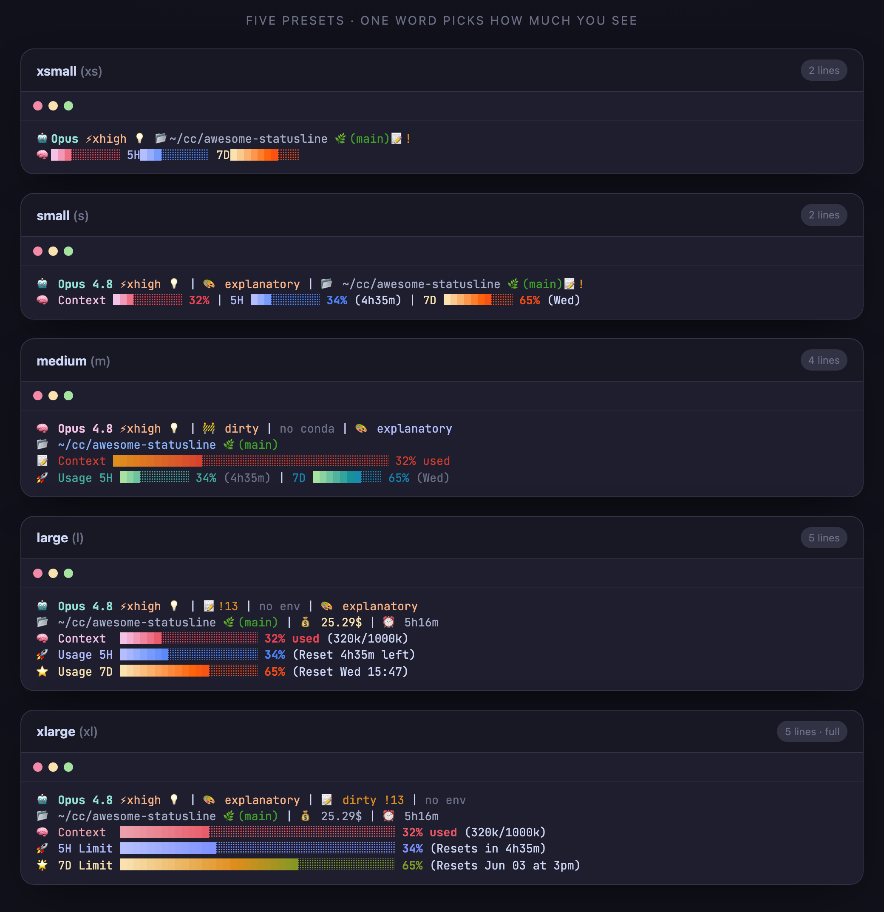

<div align="center">

# ⚡ Awesome Statusline

**[Claude Code](https://claude.com/claude-code)를 위한 아름다운 상태줄 — 컨텍스트, 사용량 한도, 비용, 추론 강도(`⚡effort`)를 한눈에. macOS·Linux·Windows 한 줄 설치.**

[🇺🇸 English](README.md) · [빠른 설치](#-빠른-설치) · [프리셋](#-5가지-프리셋) · [표시 항목](#-무엇을-보여주나요) · [FAQ](#-faq)


<br/><br/>



<sub>▶ <a href="https://awesomejun.github.io/CC-statusline/">인터랙티브 라이브 데모</a></sub>

</div>

---

## 🆕 업데이트 소식

Claude Code 최신 기능에 맞춰 계속 업데이트됩니다 — 최근 내역:

| 날짜 | 업데이트 |
|------|----------|
| **2026-06-02** | **Windows 네이티브 렌더러** — PowerShell 상태줄 경로, Windows에서 Git Bash나 `jq` 불필요 |
| **2026-05-31** | **Opus 4.8** 지원 · 추론 강도 **effort**(`high`/`xhigh`/`max`) + **thinking** 표시 · 크로스플랫폼 한 줄 설치 · 5단계 프리셋(`xs`–`xl`) · JetBrains Mono |
| **2026-04-01** | **1M 토큰 컨텍스트 창** 지원(Opus) · 첫 대화 전에도 사용량 바 표시 |
| **2026-01-19** | 멀티 모드 디스플레이 시스템 · 플러그인 마켓플레이스 |
| **2026-01-18** | Catppuccin 그래디언트 바 · 실시간 **5시간 / 7일** 사용량 한도 모니터링 |

---

## 주요 특징

- ⚡ **추론 강도 & thinking** — `/effort`(`high`/`xhigh`/`max`)와 확장 사고를 Claude Code 공식 상태줄 JSON에서 실시간 표시 (effort 미지원 모델에선 자동 숨김).
- 📊 **5시간 / 7일 사용량** — 공식 rate-limit API 기반 한도 바로 남은 예산을 한눈에.
- 🖥️ **Node·Nerd Font 불필요** — macOS/Linux는 Bash, Windows는 네이티브 PowerShell, 표준 이모지 사용.
- 📦 **Windows 추가 의존성 없음** — Windows는 내장 PowerShell을 사용하고, macOS/Linux에서만 필요 시 `jq`를 자동 설치합니다.
- 📐 **5단계 프리셋**(`xs`–`xl`) — 한 단어로 정보량 선택.

> 훌륭한 Claude Code 상태줄이 이미 여럿 있습니다. 이 프로젝트는 그중 추론 강도(effort)/thinking 가시성과 무설치 크로스플랫폼 설치에 집중합니다.

---

## 🚀 빠른 설치

Node가 필요 없습니다. Windows에서는 `jq`, Git, Git Bash도 필요 없습니다 — 설치 스크립트가 PowerShell 경로를 사용합니다.

**macOS / Linux**
```bash
curl -fsSL https://raw.githubusercontent.com/AwesomeJun/CC-statusline/main/install.sh | bash
```

**Windows (PowerShell)**
```powershell
irm https://raw.githubusercontent.com/AwesomeJun/CC-statusline/main/install.ps1 | iex
```

보안 프로그램이 `irm | iex`를 막으면, 먼저 파일로 내려받아 확인한 뒤 실행하세요:
```powershell
Invoke-WebRequest -Uri https://raw.githubusercontent.com/AwesomeJun/CC-statusline/main/install.ps1 -OutFile .\install.ps1
notepad .\install.ps1
powershell -NoProfile -ExecutionPolicy Bypass -File .\install.ps1
```

특정 크기를 원하면 명시적으로 붙이면 됩니다:
```bash
curl -fsSL https://raw.githubusercontent.com/AwesomeJun/CC-statusline/main/install.sh | bash -s -- xl
```

**또는 클론 후 실행**:
```bash
git clone https://github.com/AwesomeJun/CC-statusline.git && cd CC-statusline
./install.sh            # macOS / Linux
./install.ps1           # Windows PowerShell
```

원하는 크기를 명시할 수도 있습니다 — 약어·풀네임 둘 다 가능: `xs`/`xsmall`, `s`/`small`, `m`/`medium`, `l`/`large`, `xl`/`xlarge`.
그다음 Claude Code를 재시작하면 끝입니다.

---

## 📐 5가지 프리셋

한 단어로 정보량을 고릅니다. 작은 것 → 큰 것:

| 크기 | 줄 수 | 한눈에 |
|------|:-----:|--------|
| `xsmall` (`xs`) | 2 | 모델 · effort · thinking · 경로 · 브랜치 · 작은 바 3개 |
| `small` (`s`) | 2 | + 라벨, 퍼센트, 출력 스타일 |
| `medium` (`m`) | 4 | 클래식 레이아웃, 전체폭 컨텍스트 바 |
| `large` (`l`) | 5 | + 비용, 세션 시간, 20블록 사용량 바 |
| `xlarge` (`xl`) | 5 | 전부: git ahead/behind, env, 40블록 바, 리셋 시각 |

> 🔤 *내* 폰트에선 어떻게 보일까요? **[12개 폰트 쇼케이스 →](demo.md)** — 크로스플랫폼 모노 폰트 10개와 Menlo, MesloLGS 포함.

<details>
<summary>📋 텍스트 미리보기 (복사용)</summary>
<br/>

색상은 실제 터미널에서 렌더됩니다:

```text
xsmall ─ 2줄
🤖Opus ⚡high 💡 📂~/project 🌿(main)
🧠████░░░░░░ 5H████░░░░░░ 7D██░░░░░░░░

small ─ 2줄
🤖 Opus 4.8 ⚡high 💡 │ 🎨 default │ 📂 ~/project 🌿(main)
🧠 Context ████░░░░░░ 43% │ 5H ████░░░░░░ 42% │ 7D ██░░░░░░░░ 18%

medium ─ 4줄
🧠 Opus 4.8 ⚡high 💡 │ 🚧 dirty │ no conda │ 🎨 default
📂 ~/project 🌿(main)
📝 Context █████████████████░░░░░░░░░░░░░░░░░░░░░░░ 43% used
🚀 Usage 5H ████░░░░░░ 42% │ 7D ██░░░░░░░░ 18%

large ─ 5줄
🤖 Opus 4.8 ⚡high 💡 │ 📝 +5 !12 │ 🐍 venv │ 🎨 default
📂 ~/project 🌿(main) │ 💰 1.23$ │ ⏰ 1h2m
🧠 Context  █████████░░░░░░░░░░░ 43% used (87k/200k)
🚀 Usage 5H ████████░░░░░░░░░░░░ 42% (Reset 2h15m left)
⭐ Usage 7D ████░░░░░░░░░░░░░░░░ 18% (Reset Thu 19:00)

xlarge ─ 5줄
🤖 Opus 4.8 ⚡high 💡 │ 🎨 default │ 📝 dirty +5 !12 │ 🐍 venv
📂 ~/project 🌿(main) │ 💰 1.23$ │ ⏰ 1h2m
🧠 Context  █████████████████░░░░░░░░░░░░░░░░░░░░░░░ 43% used (87k/200k)
🚀 5H Limit █████████████████░░░░░░░░░░░░░░░░░░░░░░░ 42% (Resets in 2h15m)
🌟 7D Limit ███████░░░░░░░░░░░░░░░░░░░░░░░░░░░░░░░░░ 18% (Resets Dec 31 at 7pm)
```

</details>

---

## 🎨 무엇을 보여주나요

| 항목 | 의미 |
|------|------|
| 🤖 **모델** | 현재 모델 (`Opus 4.8` 등) |
| ⚡ **Effort** | 추론 강도 — `low`/`medium`/`high`/`xhigh`/`max`. `/effort`로 실시간. 모델이 effort를 지원하지 않으면 숨김. |
| 💡 **Thinking** | 세션에 확장 사고가 켜져 있음 |
| 🎨 **스타일** | 현재 출력 스타일 |
| 🌿 **Git** | 브랜치, dirty/clean, ahead ↑ / behind ↓ (xlarge) |
| 🐍 **Env** | 활성 conda / virtualenv |
| 🧠 **컨텍스트** | 컨텍스트 창 사용량 바 + 토큰 수 |
| 💰 **비용 / ⏰ 시간** | 세션 비용(USD)과 경과 시간 |
| 🚀 **5시간 / 🌟 7일** | 사용량 한도 바 + 리셋 시각 (Pro/Max, 공식 rate-limit API) |

모든 색은 [Catppuccin](https://catppuccin.com/) 팔레트를 따릅니다. Nerd Font 불필요 — 모든 글리프는 표준 이모지/유니코드 블록입니다.

---

## 🔧 크기 변경 / 제거

**크기 변경** — 설치 스크립트를 새 크기로 다시 실행하면 됩니다:
```bash
./install.sh m          # 또는: curl … | bash -s -- m
```

**제거** — `~/.claude/settings.json`에서 `statusLine` 항목을 지우고(설치할 때마다 타임스탬프 백업이 만들어집니다) `~/.claude/awesome-statusline.sh` 또는 `~/.claude/awesome-statusline.ps1`을 삭제하면 됩니다.

---

## ✅ 요구사항

| 의존성 | 이유 | 설치 경로 |
|-----------|------|-----------|
| `jq` *(macOS/Linux 전용)* | Bash 상태줄 JSON 파싱 | brew / apt / dnf / pacman / zypper / apk |
| PowerShell *(Windows 내장)* | Windows 상태줄 JSON 파싱/렌더링 | Windows 기본 포함 |

Windows에서는 설치 스크립트가 네이티브 `awesome-statusline.ps1`을 쓰고 Claude Code가 `powershell -NoProfile ...`로 실행하게 설정합니다. 그래서 Git Bash, `.sh` 파일 연결, `jq` PATH 문제를 피합니다.

---

## 🙋 FAQ

**Claude Code가 느려지나요?** 아니요 — 갱신마다 도는 작은 로컬 스크립트입니다.

**`⚡effort`가 안 보여요.** 현재 모델이 effort 파라미터를 노출하지 않아 의도적으로 숨긴 것입니다. `/effort`를 지원하는 모델(예: Opus 4.x)로 바꾸세요.

**왜 Nerd Font 아이콘 대신 이모지인가요?** 폰트 설치 없이 어떤 터미널에서도 바로 제대로 보이게 하려고요.

**기존 설정은 어디 갔나요?** 설치할 때마다 `settings.json`을 `settings.json.backup-<타임스탬프>`로 백업한 뒤 건드립니다.

**상태줄이 비어 보이거나, 빈 터미널 창이 계속 떠요 (Windows).** `./install.ps1`을 다시 실행하세요 — 이제 네이티브 PowerShell 렌더러를 설치해서 Git Bash와 `jq` 의존성을 제거합니다. 자세히: [TROUBLESHOOTING.md](TROUBLESHOOTING.md).

**tmux 안에서 글자가 세로로 한 줄씩 쪼개져요.** `~/.tmux.conf`에 truecolor를 켜고(`set -ga terminal-overrides ",xterm-256color:RGB"`) tmux를 리로드하세요. 자세히: [TROUBLESHOOTING.md](TROUBLESHOOTING.md).

---

## 🧩 플러그인 마켓플레이스로 설치하기

Claude Code 플러그인 시스템을 선호하신다면, 마켓플레이스 플러그인으로도 배포됩니다:

```
/plugin marketplace add AwesomeJun/CC-statusline
/plugin install awesome-statusline
```

설치 후 `/statusline-setup`을 실행하면 적용됩니다. `/statusline-setup xl`처럼 크기를 넘길 수도 있습니다. 위의 한 줄 `install.sh`가 메인 경로이고, 이건 대안입니다.

---

<div align="center">

Claude Code 커뮤니티를 위해 🩵 으로 제작 · [Catppuccin](https://catppuccin.com/) 테마 · MIT License

⭐ **터미널이 더 예뻐졌다면 별을 눌러주세요.**

</div>
