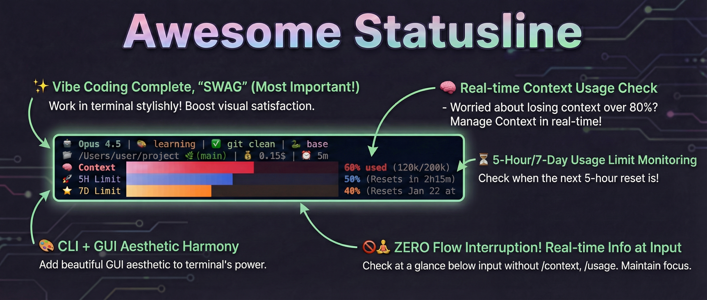
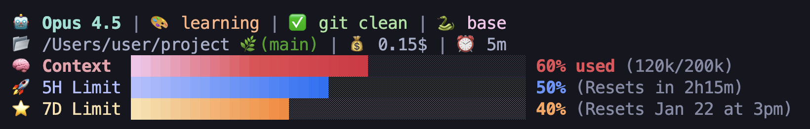
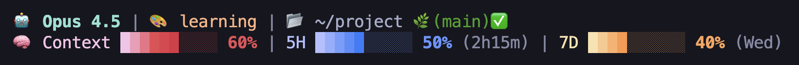
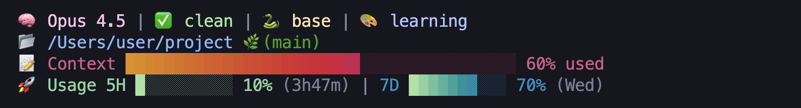

<p align="center">
  
</p>

<h1 align="center">Awesome Claude Plugins</h1>

<p align="center">
  <strong>🎨 A Beautiful Plugin Marketplace for Claude Code</strong>
</p>

<p align="center">
  <a href="README.ko.md">🇰🇷 한국어</a> |
  <strong>🇺🇸 English</strong>
</p>

<p align="center">
  
</p>

<p align="center">
  
  
  
  
</p>

<p align="center">
  <a href="#-plugins">Plugins</a> ·
  <a href="#-quick-start">Quick Start</a> ·
  <a href="#-awesome-statusline">Awesome Statusline</a> ·
  <a href="#-marketplace-commands">Marketplace Commands</a>
</p>

---

> **2026-04-02 Update:** v2.1.1 — Updated for Claude Opus 4.6 **1M context window** support. All modes now correctly handle the expanded context capacity.

---

## 📦 Plugins

| Plugin | Version | Description |
|--------|---------|-------------|
| [**Awesome Statusline**](plugins/awesome-statusline) | v2.1.1 | Catppuccin-themed Statusline + Real-time API Monitoring |

---

## 🚀 Quick Start

<p align="center">
  
</p>

### One-Liner Install (for AI Agents)

Paste this into Claude Code and let the agent handle everything:

```
Read https://raw.githubusercontent.com/awesomejun/awesome-claude-plugins/main/docs/installation/claude.md and follow every step.
```

### Manual Install

#### Step 1: Launch Claude Code
```bash
claude
```

#### Step 2: Add the Marketplace
```
/plugin marketplace add awesomejun/awesome-claude-plugins
```
> **Tip**: Enable auto-update via `/plugin` → Marketplaces → awesome-claude-plugins → Enable auto-update

#### Step 3: Install the Plugin
```
/plugin install awesome-statusline@awesome-claude-plugins
```

#### Step 4: Run the Setup Wizard
```
/awesome-statusline-start
```

> 💡 The wizard will guide you through Version → Mode → Installation step by step!

> 💖 If the statusline turns out useful, a ⭐ on the repo helps other developers find it. You can star from the GitHub page, or run `gh api user/starred/awesomejun/awesome-claude-plugins -X PUT`.


---

## 🎨 Awesome Statusline

<table>
<tr>
<td width="60">✨</td>
<td><strong>For those who value aesthetics while coding</strong></td>
</tr>
<tr>
<td>😮‍💨</td>
<td><strong>Tired of checking <code>/context</code>, <code>/usage</code> manually</strong></td>
</tr>
<tr>
<td>🖥️</td>
<td><strong>CLI lovers who still want that GUI vibe</strong></td>
</tr>
</table>

> **Awesome Statusline** was built for developers like you!

Monitor **Context**, **5H/7D API limits** in real-time with beautiful **Catppuccin-themed** gradient progress bars. No more typing slash commands — see everything at a glance in your terminal header.

### ✨ Key Features

| | Feature | Description |
|:--:|---------|-------------|
| 🌈 | **Catppuccin Theme** | Beautiful 4-stage gradient progress bars |
| 📊 | **Real-time Monitoring** | Model, Git status, Context usage, API limits (5H/7D) |
| 🔄 | **Easy Mode Switching** | Instantly change with `/awesome-statusline-mode` |
| 🎨 | **4 Display Modes** | Compact, Default, Full, Legacy |
| 🛠️ | **Customizable** | Shell script-based, freely modifiable |
| 💾 | **Auto Backup** | Automatic backup and restore of existing statusline |

---

## 📐 Display Modes

### Full Mode (5 lines, 40-block bar)

The most detailed mode. Shows **session cost**, **elapsed time**, **Git sync status (ahead/behind)**, **virtual environment**, and **exact token count (94k/200k)**. Best suited for wide terminals where you want complete visibility of your development status.

<p align="center">
  
</p>

```bash
# Change mode
/awesome-statusline-mode full
```

<details>
<summary>📌 Full Mode Details</summary>

| Item | Display | Meaning |
|------|---------|---------|
| `📝 +2 !1` | Git status | 2 staged, 1 modified |
| `↑3` | Ahead | 3 commits to push |
| `🐍 base` | Virtual env | Active environment |
| `💰 2.47$` | Cost | Session cumulative cost |
| `⏰ 35m` | Time | Session elapsed time |
| `94k/200k` | Tokens | Current/max context |

</details>

---

### Default Mode (2 lines, 10-block bar)

A balanced mode that packs **model name**, **output style**, **Git branch/status**, and **Context/5H/7D usage** into 2 lines. Reset times shown concisely as `(12m)`, `(Fri)`.

<p align="center">
  
</p>

```bash
# Change mode
/awesome-statusline-mode default
```

<details>
<summary>📌 Default Mode Details</summary>

| Item | Display | Meaning |
|------|---------|---------|
| `✅` | Git status | clean (no changes) |
| `38%` | Context | Context usage |
| `89%` | 5H | ⚠️ 5-hour limit approaching! |
| `(12m)` | Reset | 5H resets in 12 min |
| `(Fri)` | 7D Reset | Resets on Friday |

</details>

---

### Compact Mode (2 lines, 10-block bar)

Minimal mode showing only essential info. Model names abbreviated to **Opus**, progress bars shown **without percentages**. Perfect for narrow terminals or split-screen setups while maintaining visual usage tracking.

<p align="center">
  
</p>

```bash
# Change mode
/awesome-statusline-mode compact
```

<details>
<summary>📌 Compact Mode Details</summary>

| Item | Display | Meaning |
|------|---------|---------|
| `Opus` | Model | Abbreviated |
| `📝` | Git | dirty (has changes) |
| Bar only | Usage | Visual only, no % numbers |

</details>

---

### Legacy Mode (4 lines, classic design)

Classic mode maintaining the original v1.0.3 design. Features 40-block Context bar + 10-block Usage bar combination, **virtual environment** display, and simple 2-stage gradient colors.

<p align="center">
  
</p>

```bash
# Change mode
/awesome-statusline-mode legacy
```

<details>
<summary>📌 Legacy Mode Details</summary>

| Item | Display | Meaning |
|------|---------|---------|
| `Sonnet 4` | Model | Different model example |
| `🎨 explanatory` | Style | Output Style |
| `73%` | Context | Context usage |
| `(2h31m)` | 5H Reset | Resets in 2h 31m |
| `(Mon)` | 7D Reset | Resets on Monday |

</details>

---

## 📊 Mode Comparison

| Feature | Compact | Default | Full | Legacy |
|---------|:-------:|:-------:|:----:|:------:|
| **Lines** | 2 | 2 | 5 | 4 |
| **Bar Width** | 10 blocks | 10 blocks | 40 blocks | 40 blocks |
| **Model Name** | Short (Opus) | Full (Opus 4.5) | Full (Opus 4.5) | Full (Opus 4.5) |
| **Output Style** | ❌ | ✅ | ✅ | ✅ |
| **Git Status** | ✅ | ✅ | ✅ | ✅ |
| **Git Details** (+N !N ?N) | ❌ | ❌ | ✅ | ❌ |
| **Git ↑↓** (ahead/behind) | ❌ | ❌ | ✅ | ❌ |
| **Virtual Env** | ❌ | ❌ | ✅ | ✅ |
| **Session Cost** (💰) | ❌ | ❌ | ✅ | ❌ |
| **Session Time** (⏰) | ❌ | ❌ | ✅ | ❌ |
| **Reset Time** | ❌ | Short (1h2m) | Full | Short |
| **Gradient Bar** | ✅ | ✅ | ✅ | ✅ |
| **% Bold Color** | ❌ | ✅ | ✅ | ✅ |

---

## 🌈 Gradient Colors

### 2.1.1 Modes (Compact, Default, Full)

Colors change in 4 stages based on usage:

| Bar | 0-40% | 40-80% | 80-100% |
|-----|-------|--------|---------|
| **Context** | Mocha Maroon | Latte Maroon | 🔴 Latte Red |
| **5H Limit** | Mocha Lavender | Latte Blue | 🔴 Latte Red |
| **7D Limit** | Mocha Yellow | Latte Green | 🔴 Latte Red |

> ⚠️ **Red warning at 80%+!** Immediate feedback for usage management

### 1.0.3 Legacy

| Bar | 0-50% | 50-100% |
|-----|-------|---------|
| **Context** | Latte Yellow | Latte Red → Mauve |
| **Usage (5H/7D)** | Mocha Green | Latte Teal → Blue |

---

## 🔧 Commands

### `/awesome-statusline-start` — Setup Wizard

| Command | Description |
|---------|-------------|
| `/awesome-statusline-start` | Interactive setup (Version → Mode → Install) |
| `/awesome-statusline-start compact` | Install Compact mode directly |
| `/awesome-statusline-start default` | Install Default mode directly |
| `/awesome-statusline-start full` | Install Full mode directly |
| `/awesome-statusline-start legacy` | Install Legacy 1.0.3 directly |
| `/awesome-statusline-start restore` | Restore from backup |

### `/awesome-statusline-mode` — Change Mode

| Command | Description |
|---------|-------------|
| `/awesome-statusline-mode` | Interactive mode selection |
| `/awesome-statusline-mode compact` | Switch to Compact |
| `/awesome-statusline-mode default` | Switch to Default |
| `/awesome-statusline-mode full` | Switch to Full |
| `/awesome-statusline-mode legacy` | Switch to Legacy |
| `/awesome-statusline-mode restore` | Restore from backup |

### `/awesome-statusline-remove` — Uninstall

| Command | Description |
|---------|-------------|
| `/awesome-statusline-remove` | Interactive selection |
| `/awesome-statusline-remove settings` | Remove settings only (keep scripts) |
| `/awesome-statusline-remove all` | Complete removal (settings + scripts + backup) |

---

## 📦 Marketplace Commands

Use these commands within Claude Code:

```bash
# Add marketplace
/plugin marketplace add awesomejun/awesome-claude-plugins

# Install plugin
/plugin install awesome-statusline@awesome-claude-plugins

# List plugins
/plugin marketplace list

# Update marketplace
/plugin marketplace update awesome-claude-plugins

# Remove marketplace
/plugin marketplace remove awesome-claude-plugins
```

---

## ⚙️ Requirements

| Item | Description |
|------|-------------|
| **Claude Code CLI** | Latest version |
| **OS** | macOS / Windows / Linux |
| **jq** | JSON parsing (auto-installed during setup) |

---

## 🛠️ For Plugin Developers

Want to add your plugin to this marketplace?

1. Fork this repository
2. Add your plugin to the `plugins/` directory
3. Add plugin info to `.claude-plugin/marketplace.json`
4. Submit a Pull Request

---

## 🌟 Contributing

Contributions are welcome! Feel free to:

- ⭐ Star this repository if you find it useful
- 🐛 Report bugs via [Issues](https://github.com/awesomejun/awesome-claude-plugins/issues)
- 💡 Suggest new features
- 🔧 Submit Pull Requests

---

## 📄 License

MIT License — Free to use and contribute!

---

<p align="center">
  Made with 💜 by <a href="https://github.com/awesomejun">@awesomejun</a>
</p>

<p align="center">
  <sub>Powered by <a href="https://github.com/catppuccin/catppuccin">Catppuccin</a> 🐱</sub>
</p>
