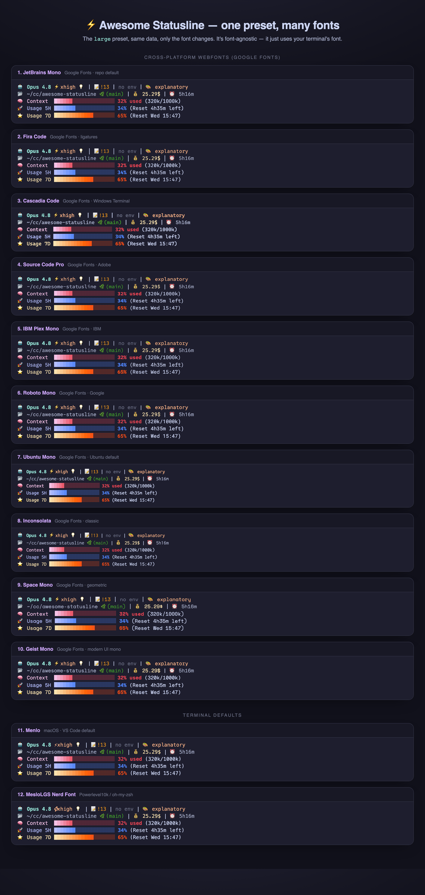

# 🔤 Font showcase

**The `large` preset rendered in 12 monospace fonts.**

The statusline is font-agnostic — it just uses your terminal's font. Here's how it looks across 10 cross-platform webfonts plus Menlo and MesloLGS.

[← Back to README](README.md) · [▶ Live HTML](https://awesomejun.github.io/CC-statusline/fonts.html)

## What does *your* terminal use?

For this showcase, the terminal-default group is kept to the two local fonts included in the 12-font image:

| OS / Terminal | Default monospace font |
|---------------|------------------------|
| **macOS** — VS Code terminal | **Menlo** |
| Powerlevel10k / oh-my-zsh | MesloLGS Nerd Font |

> The first 10 cards use cross-platform webfonts; the final 2 cards use local terminal defaults.

## The 12 fonts

**Cross-platform** (Google Fonts — embeds anywhere)

| # | Font | Note |
|---|------|------|
| 1 | [JetBrains Mono](https://fonts.google.com/specimen/JetBrains+Mono) | repo default · dotted zero |
| 2 | [Fira Code](https://fonts.google.com/specimen/Fira+Code) | programming ligatures |
| 3 | [Cascadia Code](https://fonts.google.com/specimen/Cascadia+Code) | Windows Terminal family |
| 4 | [Source Code Pro](https://fonts.google.com/specimen/Source+Code+Pro) | Adobe |
| 5 | [IBM Plex Mono](https://fonts.google.com/specimen/IBM+Plex+Mono) | IBM |
| 6 | [Roboto Mono](https://fonts.google.com/specimen/Roboto+Mono) | Google |
| 7 | [Ubuntu Mono](https://fonts.google.com/specimen/Ubuntu+Mono) | Ubuntu default |
| 8 | [Inconsolata](https://fonts.google.com/specimen/Inconsolata) | classic humanist |
| 9 | [Space Mono](https://fonts.google.com/specimen/Space+Mono) | geometric, distinctive |
| 10 | [Geist Mono](https://fonts.google.com/specimen/Geist+Mono) | modern UI mono |

**Terminal defaults** (no install needed when already present)

| # | Font | Where it's the default |
|---|------|------------------------|
| 11 | **Menlo** | macOS · VS Code terminal |
| 12 | MesloLGS Nerd Font | Powerlevel10k / oh-my-zsh |

> The image is generated by [`docs/build_fonts.py`](docs/build_fonts.py) from the **real** statusline output (same `large` preset, only the font changes). Regenerate with `python3 docs/build_fonts.py` + a headless-Chrome screenshot.
